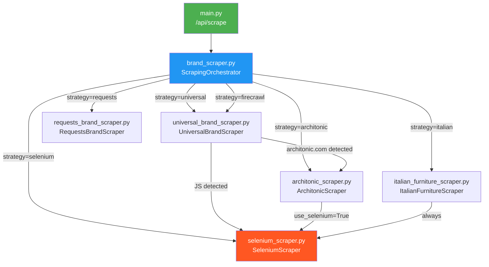

# Scraperpy Architecture Analysis & Fix Plan

## 1. File Inventory

| File | Lines | Role |
|------|-------|------|
| [main.py](file:///c:/Users/Mohamad60025/Desktop/App/SCRAPERS%20WEB/Scraperpy/main.py) | 62 | FastAPI entry point — single `/api/scrape` POST endpoint |
| [brand_scraper.py](file:///c:/Users/Mohamad60025/Desktop/App/SCRAPERS%20WEB/Scraperpy/brand_scraper.py) | 83 | **Orchestrator** — routes `strategy` param to the right module |
| [universal_brand_scraper.py](file:///c:/Users/Mohamad60025/Desktop/App/SCRAPERS%20WEB/Scraperpy/universal_brand_scraper.py) | 1603 | Smart scraper: detects JS need, detects Architonic, category hierarchy |
| [architonic_scraper.py](file:///c:/Users/Mohamad60025/Desktop/App/SCRAPERS%20WEB/Scraperpy/architonic_scraper.py) | 1702 | Architonic-specific: collections discovery, product extraction, description enrichment |
| [italian_furniture_scraper.py](file:///c:/Users/Mohamad60025/Desktop/App/SCRAPERS%20WEB/Scraperpy/italian_furniture_scraper.py) | 697 | Italian .it sites: Martex, Manerba, LAS, etc. |
| [requests_brand_scraper.py](file:///c:/Users/Mohamad60025/Desktop/App/SCRAPERS%20WEB/Scraperpy/requests_brand_scraper.py) | 949 | Pure static HTTP scraper, no browser |
| [selenium_scraper.py](file:///c:/Users/Mohamad60025/Desktop/App/SCRAPERS%20WEB/Scraperpy/selenium_scraper.py) | 306 | Chrome WebDriver wrapper: `get_page()`, `scroll_to_bottom()`, `close()` |
| [product_enricher.py](file:///c:/Users/Mohamad60025/Desktop/App/SCRAPERS%20WEB/Scraperpy/product_enricher.py) | 211 | BOQ data enrichment (references `universal_brand_scraper`) |

---

## 2. Call Graph



> [!IMPORTANT]
> **Every scraper that needs a browser goes through `selenium_scraper.py`.**
> This file is the single chokepoint. If it breaks, *everything* breaks.

---

## 3. Critical Bugs Found

### Bug 1: `SeleniumScraper.__init__()` signature mismatch ⭐ **ROOT CAUSE OF ALL FAILURES**

**The error in Railway logs:**
```
SeleniumScraper.__init__() got an unexpected keyword argument 'headless'
```

**Why it happens:** The deployed `selenium_scraper.py` on Railway still has the old `__init__(self)` with no parameters. Our earlier commit added `headless` and `timeout` params, but **the Railway build hasn't picked up the latest commit yet**, or there's a caching issue.

Meanwhile, every consumer passes keyword args:

| Caller | Call |
|--------|------|
| [architonic_scraper.py:103](file:///c:/Users/Mohamad60025/Desktop/App/SCRAPERS%20WEB/Scraperpy/architonic_scraper.py#L103) | `SeleniumScraper(headless=True, timeout=120)` |
| [italian_furniture_scraper.py:119](file:///c:/Users/Mohamad60025/Desktop/App/SCRAPERS%20WEB/Scraperpy/italian_furniture_scraper.py#L119) | `SeleniumScraper(headless=True, timeout=60)` |
| [brand_scraper.py:55](file:///c:/Users/Mohamad60025/Desktop/App/SCRAPERS%20WEB/Scraperpy/brand_scraper.py#L55) | `SeleniumScraper()` (no args — works either way) |

**Fix:** Ensure the deployed `selenium_scraper.py.__init__` accepts `headless` and `timeout` kwargs. ✅ **Already fixed locally.**

---

### Bug 2: Driver created in `__init__` — crashes on import if Chrome not installed

```python
# selenium_scraper.py line 44
def __init__(self, headless=True, timeout=30, *args, **kwargs):
    ...
    self.driver = self._get_lean_driver()  # ← THIS CRASHES if Chrome is missing
```

**Problem:** When `ArchitonicScraper` instantiates `SeleniumScraper(headless=True, timeout=120)`, the constructor immediately tries to launch Chrome. If Chrome is not installed (which is the case before nixpacks installs it), this crashes and the `except` block falls back to requests — losing all Selenium-only data.

**Better pattern:** Lazy driver initialization. Only start the browser when `get_page()` or `scrape_brand_website()` is first called.

---

### Bug 3: `italian_furniture_scraper.py` has a broken indentation bug

```python
# italian_furniture_scraper.py line 183
            soup = BeautifulSoup(scraper.driver.page_source, 'html.parser')
```

This line at [L183](file:///c:/Users/Mohamad60025/Desktop/App/SCRAPERS%20WEB/Scraperpy/italian_furniture_scraper.py#L183) is **outside** the `if use_selenium and scraper:` block due to wrong indentation. It will crash with `AttributeError: 'NoneType' object has no attribute 'driver'` when `scraper` is `None` (requests fallback path).

---

### Bug 4: `universal_brand_scraper.py` has redundant duplicate import blocks

```python
# Lines 18-30: First tries 'utils.selenium_scraper', then 'selenium_scraper', both identical
try:
    from selenium_scraper import SeleniumScraper  # L19
    ...
except ImportError:
    try:
        from selenium_scraper import SeleniumScraper  # L24 ← IDENTICAL to L19
```

The inner `try` is literally the same import as the outer one. This is dead code — the `utils.` prefix path is the old legacy layout that no longer exists.

---

### Bug 5: Clearbit DNS failures spam error logs

```
Error getting Clearbit logo: Failed to resolve 'logo.clearbit.com'
```

[architonic_scraper.py:1691-1698](file:///c:/Users/Mohamad60025/Desktop/App/SCRAPERS%20WEB/Scraperpy/architonic_scraper.py#L1691) does a synchronous DNS lookup to `logo.clearbit.com` for every brand that has no on-page logo. In Railway containers, this frequently fails and pollutes logs. Should use a short timeout and suppress repeated failures.

---

### Bug 6: Missing `/health` diagnostics — no way to check if Selenium actually works

The [health endpoint](file:///c:/Users/Mohamad60025/Desktop/App/SCRAPERS%20WEB/Scraperpy/main.py#L57) returns `{"status": "online"}` but gives no information about whether Selenium/Chrome is actually available. This makes debugging production issues much harder.

---

## 4. Module Connection Verification

| Strategy | Orchestrator Route | Module | Entry Method | ✅ Connected? |
|----------|-------------------|--------|-------------|:---:|
| `universal` | `brand_scraper.py:31` | `UniversalBrandScraper` | `.scrape_brand_website(url, brand_name)` | ✅ |
| `architonic` | `brand_scraper.py:45` | `ArchitonicScraper` | `.scrape_collection(url, brand_name)` | ✅ |
| `italian` | `brand_scraper.py:38` | `ItalianFurnitureScraper` | `.scrape_brand_website(url, brand_name)` | ✅ |
| `selenium` | `brand_scraper.py:53` | `SeleniumScraper` | `.scrape_brand_website(url, brand_name)` | ✅ |
| `requests` | `brand_scraper.py:60` | `RequestsBrandScraper` | `.scrape_brand_website(url, brand_name)` | ✅ |
| `firecrawl` | `brand_scraper.py:67` | `UniversalBrandScraper` | `.scrape_brand_website(url, brand_name, use_selenium=True)` | ✅ |

> [!NOTE]
> The orchestrator routing is correct. All 6 strategies are wired up properly. The failures are all downstream in `SeleniumScraper.__init__()`.

---

## 5. Priority Fix Plan

### Phase 1: Critical Fixes (Stop the bleeding)

| # | File | Fix | Impact |
|---|------|-----|--------|
| **1** | `selenium_scraper.py` | **Lazy driver init** — don't create Chrome in `__init__`, create it in `_ensure_driver()` called by `get_page()` and `scrape_brand_website()` | Fixes crash-on-import, allows graceful fallback |
| **2** | `selenium_scraper.py` | Add Nix/system Chromium binary path detection in `_get_lean_driver()` | Fixes Railway container Chrome discovery |
| **3** | `italian_furniture_scraper.py:183` | Fix indentation — move inside `if use_selenium` block | Fixes crash when using requests fallback |

### Phase 2: Robustness (Prevent future failures)

| # | File | Fix | Impact |
|---|------|-----|--------|
| **4** | `universal_brand_scraper.py` | Clean up duplicate import blocks | Code hygiene |
| **5** | `architonic_scraper.py` | Add timeout + suppress repeated Clearbit DNS failures | Cleaner logs |
| **6** | `main.py` | Enhance `/health` to report Selenium availability and Chrome version | Faster debugging |
| **7** | `nixpacks.toml` | Add `CHROMIUM_FLAGS` env var for Railway | Ensure headless Chrome runs correctly |

### Phase 3: Architecture Polish

| # | File | Fix | Impact |
|---|------|-----|--------|
| **8** | All scrapers | Standardize return schema: `{brand, logo, collections, all_products, total_products}` | Consistent API responses |
| **9** | `brand_scraper.py` | Add request-level timeout wrapper around all strategy calls | Prevent hung scrapes |

> [!CAUTION]
> **Phase 1 fixes (#1, #2, #3) must be deployed together.** Fix #1 alone won't help if Chrome isn't discoverable (#2), and the Italian scraper will crash independently (#3).

---

## 6. Approval Request

Do you want me to implement **all Phase 1 + Phase 2 fixes** now and push to GitHub so Railway picks them up? I'll make the changes across all files in a single commit.
